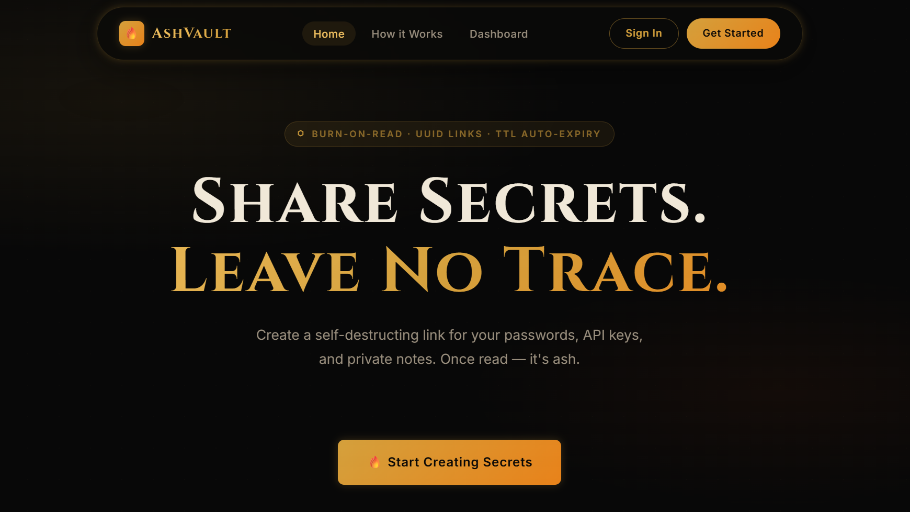
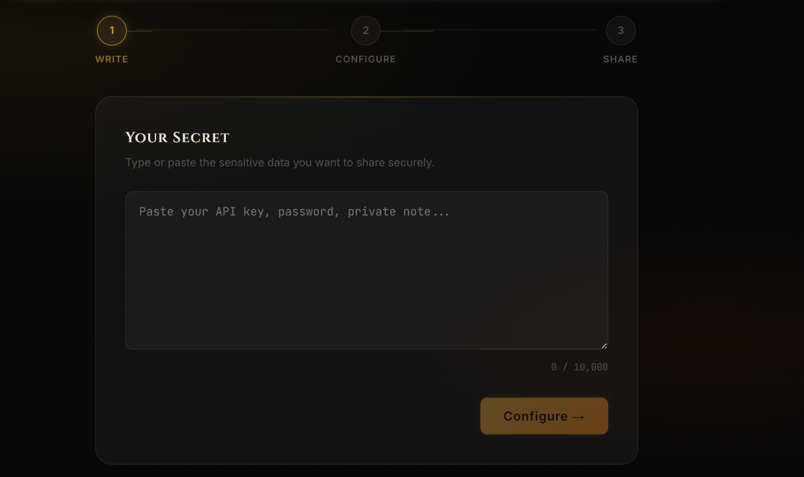
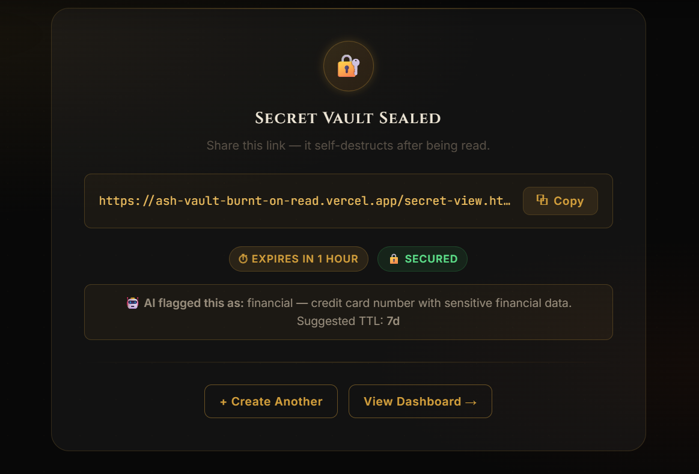
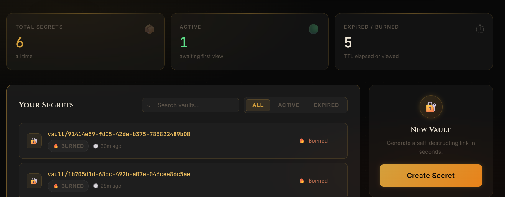
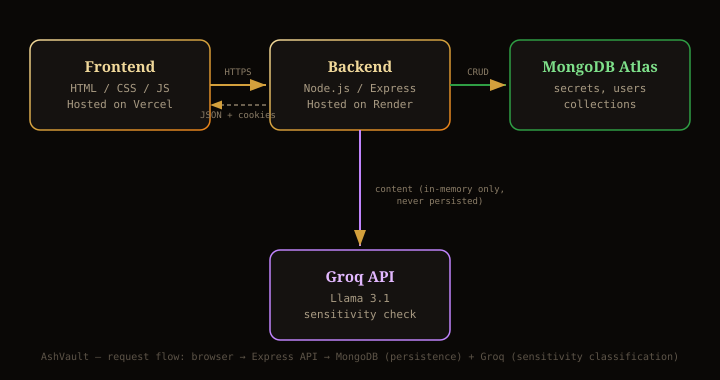
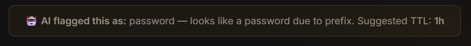

<div align="center">


# 🔥 AshVault

### Share Secrets. Leave No Trace.

**A zero-trust, burn-after-read secret sharing platform — passwords, API keys, and private notes that self-destruct the moment they're viewed.**

[](https://ash-vault-burnt-on-read.vercel.app)
[](https://ashvault-burnt-on-read.onrender.com)
[](#-license)
[](#)
[](#-tech-stack)

<br/>

</div>

<br/>

## 📖 Table of Contents

- [Overview](#-overview)
- [Features](#-features)
- [Screenshots](#-screenshots)
- [Architecture](#-architecture)
- [Tech Stack](#-tech-stack)
- [Installation](#-installation)
- [Configuration](#-configuration)
- [Usage](#-usage)
- [API Reference](#-api-reference)
- [AI Sensitivity Detection](#-ai-sensitivity-detection)
- [Deployment](#-deployment)
- [Testing](#-testing)
- [Roadmap](#-roadmap)
- [Contributing](#-contributing)
- [FAQ](#-faq)
- [License](#-license)
- [Contact](#-contact)

---

## 🕯️ Overview

AshVault lets you create a link for sensitive content — a password, an API key, a private note — that **destroys itself the instant it's opened**. No lingering copies, no recoverable history, no second read.

Every secret gets:

- A cryptographically random **UUID v4** link (2¹²² possible combinations — effectively unguessable)
- An optional **password gate** before the content is revealed
- A **TTL (time-to-live)** so unread secrets vanish automatically
- **Soft-delete burn tracking** (`isBurned` / `burnedAt`) — the record persists for audit purposes, but the content is permanently wiped, never served twice

<div align="center">

</div>

---

## ✨ Features

| | Feature | Description |
|---|---|---|
| 🔥 | **Burn-on-Read** | Content is wiped from the database the moment it's viewed — not just hidden, permanently gone. |
| 🔗 | **UUID Links** | Unguessable, cryptographically random secret URLs. |
| ⏱️ | **Auto-Expiry (TTL)** | Set 1 hour / 24 hours / 7 days — unread secrets self-destruct on schedule. |
| 🔒 | **Password Protection** | Optional passphrase gate, hashed with bcrypt before storage. |
| 🤖 | **AI Sensitivity Detection** | LLM-powered classifier flags password/API-key/PII-type content and suggests a safer TTL — see [details](#-ai-sensitivity-detection). |
| 📊 | **Dashboard** | Logged-in users can track their secrets' status (active / burned / expired) without ever seeing burned content again. |
| 🍪 | **Secure Auth** | JWT access + refresh tokens delivered via HttpOnly cookies. |

---

## 🖼️ Screenshots

<div align="center">

<br/>
<sub>Step-by-step secret creation wizard</sub>

<br/><br/>

<br/>
<sub>Generated link with AI sensitivity hint</sub>

<br/><br/>

<br/>
<sub>Dashboard — secret status at a glance</sub>

</div>

---

## 🏗️ Architecture

<div align="center">

</div>

```
┌─────────────┐        HTTPS        ┌──────────────┐       ┌────────────────┐
│  Frontend    │ ───────────────▶  │   Backend     │ ────▶ │  MongoDB Atlas  │
│  (Vercel)    │ ◀─────────────── │  (Render/     │       │  (secrets, users)│
│  HTML/JS/CSS │    JSON + Cookies │   Express)    │       └────────────────┘
└─────────────┘                    └──────┬───────┘
                                           │
                                           ▼
                                    ┌──────────────┐
                                    │  Groq API     │
                                    │ (Llama 3.1 —  │
                                    │ sensitivity    │
                                    │ classification)│
                                    └──────────────┘
```

<details>
<summary><strong>Request lifecycle for secret creation</strong></summary>

1. User submits secret content + optional password + TTL choice
2. Backend generates a UUID v4 `secretID`, hashes the password (if any), computes `expiresAt`
3. Secret document saved to MongoDB
4. Content is passed **in-memory only** to the Groq sensitivity classifier (never persisted)
5. Response returns `secretID` + AI hint; frontend renders the shareable link and hint badge

</details>

---

## 🧰 Tech Stack

<div align="center">


</div>

- **Frontend:** Vanilla HTML/CSS/JS (multi-page: `index`, `login`, `dashboard`, `secret-view`, `about`)
- **Backend:** Node.js, Express 5, Mongoose
- **Database:** MongoDB Atlas
- **Auth:** JWT (access + refresh tokens), HttpOnly cookies, bcrypt password hashing
- **AI:** Groq API (`llama-3.1-8b-instant`) for real-time content sensitivity classification
- **Hosting:** Vercel (frontend), Render (backend)

---

## ⚙️ Installation

<details open>
<summary><strong>Prerequisites</strong></summary>

- Node.js ≥ 18
- A MongoDB Atlas cluster (or local MongoDB instance)
- A free [Groq API key](https://console.groq.com)

</details>

```bash
# 1. Clone the repository
git clone https://github.com/Saubhagya1621/AshVault---Burnt-on-Read.git
cd AshVault---Burnt-on-Read
```

```bash
# 2. Install backend dependencies
cd backend
npm install
```

```bash
# 3. Install frontend (no build step — static files)
cd ../frontend
# open with a static server, e.g.
npx serve .
```

```bash
# 4. Set up environment variables (see Configuration below)
cd ../backend
cp .env.example .env
# then edit .env with your own values
```

```bash
# 5. Run the backend
cd backend
npm run dev
```

The frontend will call the backend via the `API_BASE` value in `frontend/Config.js` — update it to point at your local backend (`http://127.0.0.1:8000`) during development.

---

## 🔧 Configuration

<details>
<summary><strong>Backend <code>.env</code> variables</strong></summary>

| Variable | Description |
|---|---|
| `PORT` | Port the Express server listens on |
| `MONGODB_URI` | MongoDB Atlas connection string |
| `CORS_ORIGIN` | Allowed origin(s) for CORS |
| `ACCESS_TOKEN_SECRET` | Secret for signing JWT access tokens |
| `ACCESS_TOKEN_EXPIRY` | Access token lifetime (e.g. `1d`) |
| `REFRESH_TOKEN_SECRET` | Secret for signing JWT refresh tokens |
| `REFRESH_TOKEN_EXPIRY` | Refresh token lifetime (e.g. `10d`) |
| `ENCRYPTION_KEY` | Key used for internal encryption utilities |
| `GROQ_API_KEY` | API key for the Groq sensitivity classifier — [get one free](https://console.groq.com) |

> ⚠️ Never commit `.env` — it's already covered by `.gitignore`. Rotate any key that's ever been exposed.

</details>

<details>
<summary><strong>Frontend <code>Config.js</code></strong></summary>

```js
const API_BASE =
  window.location.hostname === "localhost" ||
  window.location.hostname === "127.0.0.1"
    ? "http://127.0.0.1:8000"
    : "https://ashvault-burnt-on-read.onrender.com";
```

Update the production fallback URL if you deploy your own backend instance.

</details>

---

## 🚀 Usage

1. **Sign up / log in** at `/login.html`
2. **Write your secret** — paste a password, API key, or note (up to 10,000 characters)
3. **Configure security** — choose expiry (1h / 24h / 7d) and optionally add a password
4. **Generate the link** — copy and share it; the AI sensitivity hint will suggest whether your TTL choice makes sense
5. Recipient opens the link **once** — content is shown, then permanently burned

---

## 📡 API Reference

<details>
<summary><strong><code>POST /api/v1/secrets/create</code></strong> — create a new secret</summary>

**Request body:**
```json
{
  "content": "sk-live-example-key",
  "password": null,
  "expiresAt": "1h"
}
```

**Response:**
```json
{
  "statusCode": 201,
  "data": {
    "secretID": "b3a1c9e0-...-uuid",
    "sensitivityHint": {
      "isSensitive": true,
      "category": "api_key",
      "suggestedTTL": "1h",
      "reason": "matches API key format"
    }
  },
  "message": "Link generated successfully!",
  "success": true
}
```

</details>

<details>
<summary><strong><code>POST /api/v1/secrets/v/:secretID</code></strong> — view (and burn) a secret</summary>

**Request body (if password-protected):**
```json
{ "password": "your-passphrase" }
```

**Response:**
```json
{
  "statusCode": 200,
  "data": { "content": "the secret content" },
  "message": "Secret retrieved and burned forever.",
  "success": true
}
```

> Calling this endpoint a second time on the same `secretID` returns `410 Gone`.

</details>

<details>
<summary><strong><code>DELETE /api/v1/secrets/burn/:secretID</code></strong> — manually destroy a secret (auth required)</summary>

Requires a valid JWT (owner only). Returns `200` with an empty payload on success.

</details>

<details>
<summary><strong><code>GET /api/v1/secrets/my-secrets</code></strong> — list the logged-in user's secrets (auth required)</summary>

Returns secret metadata only — `content` and `password` fields are always excluded.

</details>

---

## 🤖 AI Sensitivity Detection

AshVault uses a lightweight LLM classifier (**Groq / Llama 3.1**) as a non-blocking safety layer during secret creation:

- Content is analyzed **in-memory only** at creation time — the classifier's input is **never stored** in the database
- Returns a structured hint: `isSensitive`, `category` (`password` / `api_key` / `pii` / `financial` / `personal_message` / `other`), a short `reason`, and a `suggestedTTL`
- If classification fails for any reason (rate limit, network error), secret creation **still succeeds** — the hint is purely additive UX, never a blocker

<div align="center">

</div>

This was a deliberate design choice: sensitivity detection should *inform* the user, never gate or delay their ability to protect a secret.

---

## ☁️ Deployment

| Layer | Platform | Notes |
|---|---|---|
| Frontend | [Vercel](https://vercel.com) | Static hosting, auto-deploys on push to `main` |
| Backend | [Render](https://render.com) | Node web service, auto-deploys on push to `main` |
| Database | [MongoDB Atlas](https://www.mongodb.com/atlas) | Free-tier cluster |

<details>
<summary><strong>Deploying your own instance</strong></summary>

1. Fork this repo
2. Create a Render web service pointing at `/backend`, add all env variables from [Configuration](#-configuration)
3. Create a Vercel project pointing at `/frontend`
4. Update `frontend/Config.js` production URL to your Render service URL
5. Push to `main` — both platforms auto-deploy

</details>

---

## 🧪 Testing

<details>
<summary><strong>Manual test checklist</strong></summary>

- [ ] Create secret → link generates → visiting link shows content once → second visit returns `410`
- [ ] Password-protected secret rejects wrong password, accepts correct one
- [ ] TTL expiry: secret becomes inaccessible after configured time
- [ ] AI hint appears for sensitive content, stays hidden for casual text
- [ ] Dashboard reflects burned/active status correctly without exposing content

</details>

---

## 🗺️ Roadmap

- [ ] Automated test suite (Jest/Supertest)
- [ ] Rate limiting on secret view attempts
- [ ] Anomaly detection on access patterns (IP/geo heuristics)
- [ ] Optional end-to-end client-side encryption
- [ ] Multi-language UI

---

## 🤝 Contributing

Contributions are welcome!

1. Fork the repo
2. Create a feature branch: `git checkout -b feat/your-feature`
3. Commit with clear messages: `git commit -m "feat: add X"`
4. Push and open a Pull Request

Please keep PRs focused and include a short description of what changed and why.

---

## ❓ FAQ

<details>
<summary><strong>Can a burned secret ever be recovered?</strong></summary>

No. On burn, `content` is overwritten to an empty string in the database. Only metadata (`isBurned`, `burnedAt`) persists for audit purposes.

</details>

<details>
<summary><strong>Does the AI feature see my actual secret content permanently?</strong></summary>

No. Content is sent to the Groq API only for the duration of that single classification request and is never written to AshVault's database.

</details>

<details>
<summary><strong>What happens if the AI classifier is down?</strong></summary>

Secret creation still succeeds — `sensitivityHint` is simply `null` and no badge is shown.

</details>

---

## 📄 License

Distributed under the MIT License. See `LICENSE` for details.

---

## 📬 Contact

**Saubhagya Srivastava**

[](https://github.com/Saubhagya1621)
[](mailto:saubhagya1603@gmail.com)

<div align="center">
<sub>© 2026 AshVault — Built with 🔥 by Saubhagya Srivastava</sub>
</div>